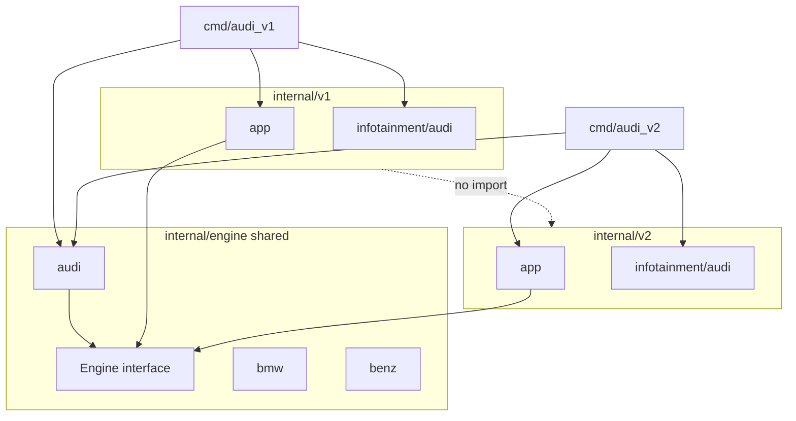

# go-project-structure

This repository demonstrates **two ways** to structure the same car-system demo (Audi, BMW, Benz × v1/v2): sibling Go modules [`sub-commands/`](sub-commands/) and [`build-tags/`](build-tags/). Both use module name `car-system` and the same behavioral model; they differ in how you select brand and version at build time.

- **InfotainmentSystem** changes with each version (v1 vs v2) and each brand (Audi, BMW, Benz). Brand implementations live under versioned infotainment packages (details in each module section below).
- **Engine** changes with each brand. For the same brand, the engine is not versioned: v1 and v2 entrypoints both use the same brand engine for that build.

Run all `go build`, `go run`, and examples from the relevant module directory: `sub-commands/` or `build-tags/`.

---

## Table of content

- [go-project-structure](#go-project-structure)
  - [Table of content](#table-of-content)
  - [Comparison](#comparison)
  - [sub-commands module](#sub-commands-module)
    - [Layout](#layout)
    - [Interfaces](#interfaces)
      - [Shared — `internal/engine`](#shared--internalengine)
      - [Versioned v1 — `internal/v1/infotainment`](#versioned-v1--internalv1infotainment)
      - [Versioned v2 — `internal/v2/infotainment`](#versioned-v2--internalv2infotainment)
    - [Wiring](#wiring)
    - [Building binaries](#building-binaries)
      - [One binary at a time](#one-binary-at-a-time)
    - [Run without building](#run-without-building)
    - [Verification](#verification)
    - [Isolation rules](#isolation-rules)
  - [build-tags](#build-tags)
    - [Layout](#layout-1)
    - [Build tags and Audi default](#build-tags-and-audi-default)
    - [APIs](#apis)
      - [Shared — `internal/engine`](#shared--internalengine-1)
      - [v1 — `internal/v1/infotainment`](#v1--internalv1infotainment)
      - [v2 — `internal/v2/infotainment`](#v2--internalv2infotainment)
    - [Building and running](#building-and-running)
      - [Default (Audi) — no tag required](#default-audi--no-tag-required)
      - [Benz and BMW — pass `-tags`](#benz-and-bmw--pass--tags)
      - [Quick reference](#quick-reference)
    - [IDE (gopls)](#ide-gopls)
    - [Verification](#verification-1)
    - [Isolation rules](#isolation-rules-1)

---

## Comparison

| Concern | sub-commands | build-tags |
|---------|--------------|------------|
| Brand selection | Six `cmd/*` binaries (`audi_v1`, `bmw_v2`, …) | Two commands + `-tags audi\|benz\|bmw` (Audi when untagged) |
| Version selection | Separate `cmd` per version | `cmd/v1` vs `cmd/v2` |
| Abstraction | Interfaces + `New()` | Package functions |
| Brand layout | Per-brand subpackages | Three mutually exclusive tagged files per package |

---

## sub-commands module

Six separate binaries (`cmd/audi_v1`, `cmd/bmw_v2`, …). Each `main` wires a shared brand engine with version-specific app and infotainment packages via interfaces and `New()`.

### Layout

```
go-project-structure/
└── sub-commands/
    ├── go.mod
    ├── bin/                                 # built executables (create via go build -o)
    ├── cmd/
    │   ├── audi_v1/main.go
    │   ├── audi_v2/main.go
    │   ├── benz_v1/main.go
    │   ├── benz_v2/main.go
    │   ├── bmw_v1/main.go
    │   └── bmw_v2/main.go
    └── internal/
        ├── engine/
        │   ├── engine.go                    # Engine interface (shared)
        │   ├── audi/audi.go
        │   ├── bmw/bmw.go
        │   └── benz/benz.go
        ├── v1/
        │   ├── app/app.go                   # Run(Engine, InfotainmentSystemV1)
        │   └── infotainment/
        │       ├── infotainment.go          # InfotainmentSystemV1 interface
        │       ├── audi/audi.go
        │       ├── bmw/bmw.go
        │       └── benz/benz.go
        └── v2/
            ├── app/app.go                   # Run(Engine, InfotainmentSystemV2)
            └── infotainment/
                ├── infotainment.go          # InfotainmentSystemV2 interface
                ├── audi/audi.go
                ├── bmw/bmw.go
                └── benz/benz.go
```



### Interfaces

#### Shared — `internal/engine`

```go
type Engine interface {
    Accelerate() string
}
```

Brand implementations return a brand-specific message string — **identical across v1 and v2** for the same brand:

| Brand | `Accelerate()` returns |
|-------|------------------------|
| Audi | `"Audi engine accelerating"` |
| BMW | `"BMW engine accelerating"` |
| Benz | `"Benz engine accelerating"` |

Both `cmd/audi_v1` and `cmd/audi_v2` call `internal/engine/audi.New()` and receive the same acceleration output.

#### Versioned v1 — `internal/v1/infotainment`

```go
type InfotainmentSystemV1 interface {
    DisplayNavigation() string
}
```

| Brand | Example output |
|-------|----------------|
| Audi | `"Audi MMI: navigation map (v1)"` |
| BMW | `"BMW iDrive: navigation map (v1)"` |
| Benz | `"Benz MBUX: navigation map (v1)"` |

#### Versioned v2 — `internal/v2/infotainment`

```go
type InfotainmentSystemV2 interface {
    DisplayNavigation(destination string) (string, error)
}
```

| Brand | Example output (destination `"Stuttgart"`) |
|-------|---------------------------------------------|
| Audi | `"Audi MMI v2: routing to Stuttgart"` |
| BMW | `"BMW iDrive v2: routing to Stuttgart"` |
| Benz | `"Benz MBUX v2: routing to Stuttgart"` |

An empty destination returns an error, demonstrating v2 error handling.

### Wiring

Each binary wires a **shared engine** with **version-specific app and infotainment** packages.

| Binary | Shared engine | Version-specific |
|--------|---------------|------------------|
| `audi_v1` | `internal/engine/audi` | `internal/v1/app`, `internal/v1/infotainment/audi` |
| `audi_v2` | `internal/engine/audi` | `internal/v2/app`, `internal/v2/infotainment/audi` |
| `benz_v1` | `internal/engine/benz` | `internal/v1/app`, `internal/v1/infotainment/benz` |
| `benz_v2` | `internal/engine/benz` | `internal/v2/app`, `internal/v2/infotainment/benz` |
| `bmw_v1` | `internal/engine/bmw` | `internal/v1/app`, `internal/v1/infotainment/bmw` |
| `bmw_v2` | `internal/engine/bmw` | `internal/v2/app`, `internal/v2/infotainment/bmw` |

Example (`cmd/audi_v1/main.go`):

```go
import (
    audiengine "car-system/internal/engine/audi"
    v1app "car-system/internal/v1/app"
    audiinfo "car-system/internal/v1/infotainment/audi"
)

func main() {
    v1app.Run(audiengine.New(), audiinfo.New())
}
```

### Building binaries

Each folder under `cmd/` is a separate `main` package. Use `go build` with `-o` to write **one executable per command** into `bin/` inside `sub-commands/`.

Run all commands below from `sub-commands/`:

```bash
cd sub-commands
mkdir -p bin
```

#### One binary at a time

| Binary | Source package | `go build` command | Output path |
|--------|----------------|------------------|-------------|
| `audi_v1` | `./cmd/audi_v1` | `go build -o bin/audi_v1 ./cmd/audi_v1` | `bin/audi_v1` |
| `audi_v2` | `./cmd/audi_v2` | `go build -o bin/audi_v2 ./cmd/audi_v2` | `bin/audi_v2` |
| `benz_v1` | `./cmd/benz_v1` | `go build -o bin/benz_v1 ./cmd/benz_v1` | `bin/benz_v1` |
| `benz_v2` | `./cmd/benz_v2` | `go build -o bin/benz_v2 ./cmd/benz_v2` | `bin/benz_v2` |
| `bmw_v1` | `./cmd/bmw_v1` | `go build -o bin/bmw_v1 ./cmd/bmw_v1` | `bin/bmw_v1` |
| `bmw_v2` | `./cmd/bmw_v2` | `go build -o bin/bmw_v2 ./cmd/bmw_v2` | `bin/bmw_v2` |

Copy-paste block for all six (from `sub-commands/`):

```bash
cd sub-commands
mkdir -p bin

go build -o bin/audi_v1 ./cmd/audi_v1
go build -o bin/audi_v2 ./cmd/audi_v2
go build -o bin/benz_v1 ./cmd/benz_v1
go build -o bin/benz_v2 ./cmd/benz_v2
go build -o bin/bmw_v1 ./cmd/bmw_v1
go build -o bin/bmw_v2 ./cmd/bmw_v2
```

Run a built binary:

```bash
./bin/audi_v1
./bin/audi_v2
# ... same pattern for benz_* and bmw_*
```

**Note:** `go build ./...` compiles every package for a quick compile check but does **not** place named executables under `bin/`. Always use `go build -o bin/<name> ./cmd/<name>` when you want shippable binaries in one place.


### Run without building

Use `go run` to execute a command without writing to `bin/`. From `sub-commands/`:

```bash
cd sub-commands

go run ./cmd/audi_v1
go run ./cmd/audi_v2
go run ./cmd/benz_v1
go run ./cmd/benz_v2
go run ./cmd/bmw_v1
go run ./cmd/bmw_v2
```

Expected output for `audi_v1`:

```text
Audi engine accelerating
navigation: Audi MMI: navigation map (v1)
```

Expected output for `audi_v2`:

```text
Audi engine accelerating
navigation: Audi MMI v2: routing to Stuttgart
```

### Verification

1. **All six binaries build into `bin/`** — run the commands in [Building binaries](#building-binaries), then e.g. `./bin/audi_v1` and `./bin/audi_v2` (from `sub-commands/`).
2. **`audi_v1` and `audi_v2`** both print `"Audi engine accelerating"` from `Accelerate()`; navigation output differs between versions.
3. **v2 error handling:** calling `DisplayNavigation("")` returns an error (`destination is required`).
4. **Version isolation:** `internal/v1` does not import `internal/v2`, and vice versa. Both versions import the same `internal/engine/{brand}` packages.

### Isolation rules

- `internal/v1` must **not** import `internal/v2` (and vice versa).
- Both versions import the same `internal/engine/{brand}` packages.
- Infotainment interfaces and implementations live only under `internal/v1/infotainment` and `internal/v2/infotainment`.
- Do **not** duplicate engines under versioned trees (`internal/v1/engine`, `internal/v2/engine`).
- Do **not** add a shared `internal/infotainment` — infotainment is versioned by design.

---

## build-tags

Two commands (`cmd/v1`, `cmd/v2`) select **version** at build time; **brand** (Audi, Benz, BMW) is selected via `-tags` at compile time (defaults to **Audi** when no tag is set).

- **Version** is chosen by which command you build: `cmd/v1` vs `cmd/v2`.
- **Brand** is chosen by `-tags` (or defaults to **Audi** when no tag is set).
- APIs are **plain package functions** (no interfaces or `New()` types).

For the six-binary layout with interfaces, see [sub-commands](#sub-commands).

### Layout

```
go-project-structure/
└── build-tags/
    ├── go.mod
    ├── AGENTS.md
    ├── .vscode/settings.json          # optional gopls tag override (default: audi)
    ├── bin/                           # build output (gitignored at repo root)
    ├── cmd/
    │   ├── v1/main.go                 # wires internal/v1/app.Run()
    │   └── v2/main.go                 # wires internal/v2/app.Run()
    └── internal/
        ├── engine/
        │   ├── engine_audi.go         //go:build audi || !(benz || bmw)
        │   ├── engine_benz.go         //go:build benz
        │   └── engine_bmw.go          //go:build bmw
        ├── v1/
        │   ├── app/app.go
        │   └── infotainment/
        │       ├── infotainment_audi.go
        │       ├── infotainment_benz.go
        │       └── infotainment_bmw.go
        └── v2/
            ├── app/app.go
            └── infotainment/
                ├── infotainment_audi.go
                ├── infotainment_benz.go
                └── infotainment_bmw.go
```

Each brand-sensitive package (`internal/engine`, `internal/v1/infotainment`, `internal/v2/infotainment`) has **exactly three** tagged files. There are **no stub** files with `panic("implement me")`.

### Build tags and Audi default

Supported tags: `audi`, `benz`, `bmw`. Pass at most **one** brand tag per build.

| Build flags | Audi file `audi \|\| !(benz \|\| bmw)` | `benz` | `bmw` | Brand compiled |
|-------------|----------------------------------------|--------|-------|----------------|
| (none) | true | false | false | **audi** (default) |
| `-tags audi` | true | false | false | audi |
| `-tags benz` | false | true | false | benz |
| `-tags bmw` | false | false | true | bmw |

**Audi default constraint** (on every `*_audi.go` file):

```go
//go:build audi || !(benz || bmw)
```

**Benz / BMW** use a single tag each:

```go
//go:build benz   // *_benz.go
//go:build bmw    // *_bmw.go
```

Exactly one brand file is compiled per package in every case — mutually exclusive, no duplicate symbols.

`cmd/v1` and `cmd/v2` do **not** import brand packages directly; they call `app.Run()`, which uses `engine` and `infotainment` functions resolved at compile time.

### APIs

#### Shared — `internal/engine`

```go
func Accelerate() string
```

| Brand | `Accelerate()` returns |
|-------|------------------------|
| Audi | `"Audi engine accelerating"` |
| BMW | `"BMW engine accelerating"` |
| Benz | `"Benz engine accelerating"` |

#### v1 — `internal/v1/infotainment`

```go
func DisplayNavigation() string
```

| Brand | Example output |
|-------|----------------|
| Audi | `"Audi MMI: navigation map (v1)"` |
| BMW | `"BMW iDrive: navigation map (v1)"` |
| Benz | `"Benz MBUX: navigation map (v1)"` |

#### v2 — `internal/v2/infotainment`

```go
func DisplayNavigation(destination string) (string, error)
```

| Brand | Example output (destination `"Stuttgart"`) |
|-------|---------------------------------------------|
| Audi | `"Audi MMI v2: routing to Stuttgart"` |
| BMW | `"BMW iDrive v2: routing to Stuttgart"` |
| Benz | `"Benz MBUX v2: routing to Stuttgart"` |

An empty destination returns `errors.New("destination is required")`.

### Building and running

Run all commands from the `build-tags/` directory (module root).

Create the output directory once:

```bash
cd build-tags
mkdir -p bin
```

#### Default (Audi) — no tag required

Untagged builds use Audi implementations (same as `-tags audi`):

```bash
cd build-tags

go build -o bin/v1_audi ./cmd/v1
go build -o bin/v2_audi ./cmd/v2

go run ./cmd/v1
go run ./cmd/v2
```

#### Benz and BMW — pass `-tags`

```bash
cd build-tags

go build -tags benz -o bin/v1_benz ./cmd/v1
go build -tags benz -o bin/v2_benz ./cmd/v2

go build -tags bmw -o bin/v1_bmw ./cmd/v1
go build -tags bmw -o bin/v2_bmw ./cmd/v2
```

#### Quick reference

| Goal | Command |
|------|---------|
| v1, Audi (default) | `go build ./cmd/v1` or `go build -tags audi ./cmd/v1` |
| v2, Audi (default) | `go build ./cmd/v2` or `go build -tags audi ./cmd/v2` |
| v1, Benz | `go build -tags benz ./cmd/v1` |
| v1, BMW | `go build -tags bmw ./cmd/v1` |
| Compile all packages (Audi) | `go build ./...` |

Expected stdout for **Audi** (untagged or `-tags audi`):

**v1:**

```text
Audi engine accelerating
navigation: Audi MMI: navigation map (v1)
```

**v2:**

```text
Audi engine accelerating
navigation: Audi MMI v2: routing to Stuttgart
```

### IDE (gopls)

Optional [`build-tags/.vscode/settings.json`](build-tags/.vscode/settings.json) sets `gopls` build flags so the editor matches the brand you are editing:

- **Default:** `-tags=audi` (matches untagged builds).
- **Benz / BMW:** change to `-tags=benz` or `-tags=bmw` while working on those `*_benz.go` / `*_bmw.go` files.

Untagged `gopls` analysis already resolves Audi via `audi || !(benz || bmw)`; the setting makes the active tag explicit.

### Verification

1. Untagged and `-tags audi` builds produce **identical** Audi output for v1 and v2.
2. `-tags benz` and `-tags bmw` produce the correct brand strings for engine and infotainment.
3. `go build ./...` with **no** tag succeeds (Audi selected).
4. `internal/v1` does not import `internal/v2`.
5. Each brand-sensitive package has exactly **three** tagged files; no stub files.

### Isolation rules

- `internal/v1` must **not** import `internal/v2` (and vice versa).
- Both versions share the same tagged `internal/engine` package for a given build.
- Do **not** add engines under versioned trees.
- When adding a new brand, add `*_brand.go` with `//go:build brand` and update the Audi constraint to exclude the new tag (e.g. `audi || !(benz || bmw || porsche)`).
