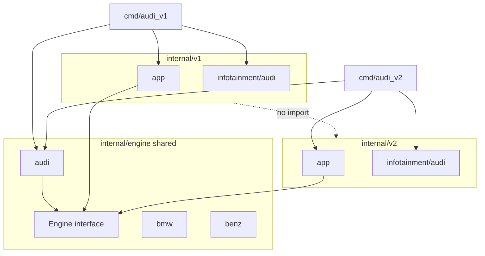

# go-project-structure

Example Go project demonstrating **shared, version-agnostic engines** alongside **version-specific infotainment systems**.

**Mental model:** one way to accelerate (shared `Engine`), two ways to display navigation (v1 vs v2 `InfotainmentSystem`).

| Concern | v1 vs v2 |
|---------|----------|
| `Engine` interface | Same — `internal/engine` |
| Brand `Accelerate()` (Audi, BMW, Benz) | Same — `internal/engine/{brand}` |
| `InfotainmentSystem` interface | Different — `InfotainmentSystemV1` vs `InfotainmentSystemV2` |
| Brand infotainment implementations | Different — `internal/v1/infotainment/{brand}` vs `internal/v2/infotainment/{brand}` |
| App orchestration | Different — `internal/v1/app` vs `internal/v2/app` |

Versioning applies to **InfotainmentSystem** only. There is no `EngineV1` / `EngineV2`.

---

## Layout

```
go-project-structure/
├── go.mod
├── README.md
├── bin/                                 # built executables (create via go build -o)
├── cmd/
│   ├── audi_v1/main.go
│   ├── audi_v2/main.go
│   ├── benz_v1/main.go
│   ├── benz_v2/main.go
│   ├── bmw_v1/main.go
│   └── bmw_v2/main.go
└── internal/
    ├── engine/
    │   ├── engine.go                    # Engine interface (shared)
    │   ├── audi/audi.go
    │   ├── bmw/bmw.go
    │   └── benz/benz.go
    ├── v1/
    │   ├── app/app.go                   # Run(Engine, InfotainmentSystemV1)
    │   └── infotainment/
    │       ├── infotainment.go          # InfotainmentSystemV1 interface
    │       ├── audi/audi.go
    │       ├── bmw/bmw.go
    │       └── benz/benz.go
    └── v2/
        ├── app/app.go                   # Run(Engine, InfotainmentSystemV2)
        └── infotainment/
            ├── infotainment.go          # InfotainmentSystemV2 interface
            ├── audi/audi.go
            ├── bmw/bmw.go
            └── benz/benz.go
```



---

## Interfaces

### Shared — `internal/engine`

```go
type Engine interface {
    Accelerate() string
}
```

Brand implementations return a brand-specific message string — **identical across v1 and v2** for the same brand:

| Brand | `Accelerate()` returns |
|-------|------------------------|
| Audi | `"Audi engine accelerating"` |
| BMW | `"BMW engine accelerating"` |
| Benz | `"Benz engine accelerating"` |

Both `cmd/audi_v1` and `cmd/audi_v2` call `internal/engine/audi.New()` and receive the same acceleration output.

### Versioned v1 — `internal/v1/infotainment`

```go
type InfotainmentSystemV1 interface {
    DisplayNavigation() string
}
```

| Brand | Example output |
|-------|----------------|
| Audi | `"Audi MMI: navigation map (v1)"` |
| BMW | `"BMW iDrive: navigation map (v1)"` |
| Benz | `"Benz MBUX: navigation map (v1)"` |

### Versioned v2 — `internal/v2/infotainment`

```go
type InfotainmentSystemV2 interface {
    DisplayNavigation(destination string) (string, error)
}
```

| Brand | Example output (destination `"Stuttgart"`) |
|-------|---------------------------------------------|
| Audi | `"Audi MMI v2: routing to Stuttgart"` |
| BMW | `"BMW iDrive v2: routing to Stuttgart"` |
| Benz | `"Benz MBUX v2: routing to Stuttgart"` |

An empty destination returns an error, demonstrating v2 error handling.

---

## Wiring

Each binary wires a **shared engine** with **version-specific app and infotainment** packages.

| Binary | Shared engine | Version-specific |
|--------|---------------|------------------|
| `audi_v1` | `internal/engine/audi` | `internal/v1/app`, `internal/v1/infotainment/audi` |
| `audi_v2` | `internal/engine/audi` | `internal/v2/app`, `internal/v2/infotainment/audi` |
| `benz_v1` | `internal/engine/benz` | `internal/v1/app`, `internal/v1/infotainment/benz` |
| `benz_v2` | `internal/engine/benz` | `internal/v2/app`, `internal/v2/infotainment/benz` |
| `bmw_v1` | `internal/engine/bmw` | `internal/v1/app`, `internal/v1/infotainment/bmw` |
| `bmw_v2` | `internal/engine/bmw` | `internal/v2/app`, `internal/v2/infotainment/bmw` |

Example (`cmd/audi_v1/main.go`):

```go
import (
    audiengine "car-system/internal/engine/audi"
    v1app "car-system/internal/v1/app"
    audiinfo "car-system/internal/v1/infotainment/audi"
)

func main() {
    v1app.Run(audiengine.New(), audiinfo.New())
}
```

---

## Building binaries

Each folder under `cmd/` is a separate `main` package. Use `go build` with `-o` to write **one executable per command** into `bin/` at the project root.

Create the output directory once (safe to re-run):

```bash
mkdir -p bin
```

### One binary at a time

| Binary | Source package | `go build` command | Output path |
|--------|----------------|------------------|-------------|
| `audi_v1` | `./cmd/audi_v1` | `go build -o bin/audi_v1 ./cmd/audi_v1` | `bin/audi_v1` |
| `audi_v2` | `./cmd/audi_v2` | `go build -o bin/audi_v2 ./cmd/audi_v2` | `bin/audi_v2` |
| `benz_v1` | `./cmd/benz_v1` | `go build -o bin/benz_v1 ./cmd/benz_v1` | `bin/benz_v1` |
| `benz_v2` | `./cmd/benz_v2` | `go build -o bin/benz_v2 ./cmd/benz_v2` | `bin/benz_v2` |
| `bmw_v1` | `./cmd/bmw_v1` | `go build -o bin/bmw_v1 ./cmd/bmw_v1` | `bin/bmw_v1` |
| `bmw_v2` | `./cmd/bmw_v2` | `go build -o bin/bmw_v2 ./cmd/bmw_v2` | `bin/bmw_v2` |

Copy-paste block for all six (from the project root):

```bash
mkdir -p bin

go build -o bin/audi_v1 ./cmd/audi_v1
go build -o bin/audi_v2 ./cmd/audi_v2
go build -o bin/benz_v1 ./cmd/benz_v1
go build -o bin/benz_v2 ./cmd/benz_v2
go build -o bin/bmw_v1 ./cmd/bmw_v1
go build -o bin/bmw_v2 ./cmd/bmw_v2
```

Run a built binary:

```bash
./bin/audi_v1
./bin/audi_v2
# ... same pattern for benz_* and bmw_*
```

**Note:** `go build ./...` compiles every package for a quick compile check but does **not** place named executables under `bin/`. Always use `go build -o bin/<name> ./cmd/<name>` when you want shippable binaries in one place.

---

## Run without building

Use `go run` to execute a command without writing to `bin/`:

```bash
go run ./cmd/audi_v1
go run ./cmd/audi_v2
go run ./cmd/benz_v1
go run ./cmd/benz_v2
go run ./cmd/bmw_v1
go run ./cmd/bmw_v2
```

Expected output for `audi_v1`:

```text
Audi engine accelerating
navigation: Audi MMI: navigation map (v1)
```

Expected output for `audi_v2`:

```text
Audi engine accelerating
navigation: Audi MMI v2: routing to Stuttgart
```

---

## Verification

1. **All six binaries build into `bin/`** — run the commands in [Building binaries](#building-binaries), then e.g. `./bin/audi_v1` and `./bin/audi_v2`.
2. **`audi_v1` and `audi_v2`** both print `"Audi engine accelerating"` from `Accelerate()`; navigation output differs between versions.
3. **v2 error handling:** calling `DisplayNavigation("")` returns an error (`destination is required`).
4. **Version isolation:** `internal/v1` does not import `internal/v2`, and vice versa. Both versions import the same `internal/engine/{brand}` packages.

---

## Isolation rules

- `internal/v1` must **not** import `internal/v2` (and vice versa).
- Both versions import the same `internal/engine/{brand}` packages.
- Infotainment interfaces and implementations live only under `internal/v1/infotainment` and `internal/v2/infotainment`.
- Do **not** duplicate engines under versioned trees (`internal/v1/engine`, `internal/v2/engine`).
- Do **not** add a shared `internal/infotainment` — infotainment is versioned by design.
